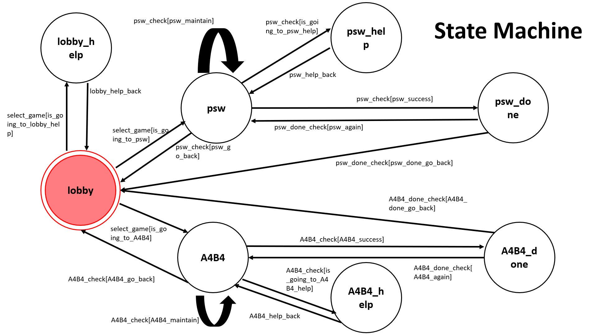

# ToC_Demo 2020

## Setup

### Prerequisite
* Python 3.6
* Pipenv
* Facebook Page and App
* HTTPS Server

#### Install Dependency
```sh
pip3 install pipenv

pipenv --three

pipenv install

pipenv shell
```

* pygraphviz (For visualizing Finite State Machine)
    * [Setup pygraphviz on Ubuntu](http://www.jianshu.com/p/a3da7ecc5303)
	* [Note: macOS Install error](https://github.com/pygraphviz/pygraphviz/issues/100)  

## Finite State Machine


## Usage
The initial state is set to `lobby`.  

### `lobby`  is triggered to `select_game` to `psw`, `A4B4`, `lobby_help`  
(1) when user key in "psw"  => go into `psw`  
(2) when user key in "A4B4" => go into `A4B4`  
(3) when user key in "help" => go into `lobby_help`  
( ** `lobby_help`  state will auto go back to `lobby` after *on_enter_lobby_help* run out ** )  
	
### `psw`  is triggered to `psw_check` to `psw`, `psw_done`, `psw_help`, `lobby`  
(1) when user key in the guess number != answer  => go into `psw`  
(2) when user key in the guess number == answer  => go into `psw_done`  
(3) when user key in "help"  => go into `psw_help`  
( ** `psw_help`  state will auto go back to `psw` after *on_enter_psw_help* run out ** )  
(4) when user key in "exit"  => go into `lobby`  

### `psw_done`  is triggered to `psw_done_check` to `psw`, `lobby`   
(1) when user key in "y" (play again)  => go into `psw`  
(2) when user key in "n" or "exit"     => go into `lobby`  

### `A4B4`  is triggered to `A4B4_check` to `A4B4`, `A4B4_done`, `A4B4_help`, `lobby`  
(1) when user key in the guess number != answer  => go into `A4B4`  
(2) when user key in the guess number == answer  => go into `A4B4_done`  
(3) when user key in "help"  => go into `A4B4_help`  
( ** `A4B4_help`  state will auto go back to `A4B4` after *on_enter_A4B4_help* run out ** )  
(4) when user key in "exit"  => go into `lobby`  

### `A4B4_done`  is triggered to `A4B4_done_check` to `A4B4`, `lobby`   
(1) when user key in "y" (play again)  => go into `A4B4`  
(2) when user key in "n" or "exit"     => go into `lobby`  

